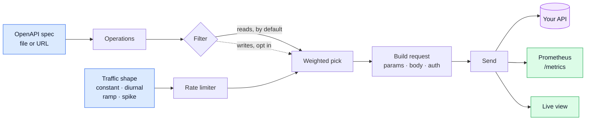

<div align="center">

# Spoofy

**Your staging environment is a ghost town. Spoofy fixes that.**

Point it at an OpenAPI spec. It generates continuous, production-shaped traffic
so your dashboards have signal and your alert thresholds can be tuned against
something other than a flat line.

[](https://github.com/ashdaily/spoofy/actions/workflows/ci.yml)
[](https://pkg.go.dev/github.com/ashdaily/spoofy)
[](https://goreportcard.com/report/github.com/ashdaily/spoofy)


</div>

---

## The problem

You built a Grafana dashboard for staging. It's empty. You wrote an alert rule.
You can't tell if it works without deliberately breaking something, so you click
around by hand until a graph twitches.

Load testing tools don't help. **k6 and Vegeta answer "can it handle 10k RPS" —
a question you ask occasionally.** Spoofy answers **"does this environment look
alive"** — a condition you want permanently true.

```bash
spoofy run --url https://staging.acme.com --rate 20/s --shape diurnal
```

That's it. It runs until you stop it.

---

## Quickstart

```bash
go install github.com/ashdaily/spoofy/cmd/spoofy@latest
```

With an `openapi.yaml` in the current directory:

```bash
spoofy run --url http://localhost:8080
```

Spoofy discovers the spec, exercises every read endpoint, and serves its own
metrics at `:9090/metrics`.

<details>
<summary><b>Not sure what it'll send? Ask first.</b></summary>

```bash
spoofy run --url http://localhost:8080 --dry-run
```

Prints a copy-pasteable `curl` for every endpoint and sends nothing:

```
GET /pets/{petId}

curl -i -X GET \
  -H "Accept: application/json" \
  -H "User-Agent: spoofy" \
  "http://localhost:8080/pets/6f1a9c2e-0b3d-4f8a-91c7-2d5e8a4b0f13"
```
</details>

---

## See it work

```bash
git clone https://github.com/ashdaily/spoofy && cd spoofy
docker compose up
```

Then open **http://localhost:3000**. A demo API, Spoofy, Prometheus, and Grafana
with the dashboard already loaded. Nothing to configure.

| | |
|---|---|
| **http://localhost:3000** | Grafana — traffic, latency percentiles, per-endpoint breakdown |
| **http://localhost:9090** | Prometheus |
| **http://localhost:9091/metrics** | Spoofy's own metrics |
| **http://localhost:8080/openapi.yaml** | The demo API's spec |

The demo API has varied latency, one deliberately slow endpoint, and a 2% error
rate — because a target that always returns 200 in 1ms produces a dashboard with
nothing on it worth looking at.

---

## How it works



**Values come from the spec before they come from a random number generator:**

```
example → examples → default → const → enum → format → pattern → type
```

A generator that emits syntactically valid nonsense produces an environment full
of 400s, which is worse than no traffic — the dashboards look busy and prove
nothing. Spec-provided examples are real values written by someone who knows the
API, so they win. `pattern` gets a small regex engine, because the fields specs
constrain that way (SKUs, account numbers, postcodes) are exactly the ones where
a random string is a guaranteed rejection.

---

## Traffic shapes

**`rate` is always the average.** Changing shape redistributes traffic without
changing the total, so you can try shapes without recalculating anything.

```yaml
traffic:
  rate: 20/s
  shape: diurnal
```

| Shape | Looks like | For |
|---|---|---|
| `constant` | `▄▄▄▄▄▄▄▄▄▄▄▄` | A predictable baseline. The default. |
| `diurnal` | `▂▁▁▂▄▆▇█▇▆▄▂` | Busy afternoons, quiet nights. Makes staging resemble prod. |
| `ramp` | `▁▂▃▄▅▆▇███████` | Watching an autoscaler react, or finding where latency turns. |
| `spike` | `▂▂█▂▂▂▂█▂▂▂▂` | Tripping alert rules on purpose. |

`diurnal` is aligned to **wall-clock time of day**, not to process start —
restarting at 3pm resumes at afternoon levels instead of putting a cliff in the
graph that looks like an incident.

<details>
<summary><b>Shape parameters</b></summary>

```yaml
traffic:
  shape: diurnal
  amplitude: 0.6        # peak is 1.6x the average, trough 0.4x
  period: 24h

  # shape: ramp
  from: 5/s
  to: 50/s
  over: 30m

  # shape: spike
  spike_every: 30m
  spike_for: 2m
  spike_rate: 100/s
```
</details>

---

## Configuration

Everything works from flags. A config file is for when you want more, never a
prerequisite. `spoofy init` writes one that documents itself.

```yaml
# spoofy.yaml
target: https://staging.acme.com
spec: ./openapi.yaml

traffic:
  rate: 1200/m          # write it how you say it: 20/s, 1200/m, 72000/h
  shape: diurnal
  concurrency: 10
  timeout: 10s

endpoints:              # first match wins, like a routing table
  - match: /admin/*
    skip: true
  - match: /orders
    weight: 5           # five times as often as everything else

auth:
  bearer: ${API_TOKEN}  # ${VARS} expand at startup — safe to commit

safety:
  allow_writes: false
  max_rate: 200/s
```

Flags override the file, because someone typing a flag is being more specific
than a file checked in months ago.

<details>
<summary><b>All flags</b></summary>

```
--url, -u             target base URL
--spec, -s            OpenAPI spec: path or URL (default: discovered)
--config, -c          config file (default: spoofy.yaml if present)
--rate, -r            average rate: 20/s, 1200/m, 72000/h
--shape               constant | diurnal | ramp | spike
--concurrency         requests in flight at once
--timeout             per-request timeout
--duration            stop after this long (default: forever)
--only / --skip       path globs; * spans /
--allow-writes        exercise POST/PUT/PATCH/DELETE
--allow-prod          permit a production-looking hostname
--dry-run             print requests as curl, send nothing
--seed                reproducible runs
--auth-bearer         bearer token
--auth-basic          user:pass
--header              extra header, repeatable
--metrics-addr        Prometheus listen address (default :9090)
--startup-timeout     how long to wait for a remote spec
```
</details>

---

## Safety

Spoofy runs unattended for weeks. A bad default isn't a bad run, it's a bad
month — so the defaults refuse rather than surprise.

| Guard | Behaviour |
|---|---|
| **Read-only** | Only `GET`/`HEAD`/`OPTIONS` until `allow_writes: true`. A daemon quietly POSTing rows into staging for a week is a data-loss incident. |
| **Production refusal** | A hostname containing `prod`/`production`/`prd` is rejected unless `allow_prod: true`. |
| **Rate ceiling** | `max_rate` (200/s default) so a typo can't flatten an environment overnight. |
| **Target backoff** | Stops hammering a service that's already failing, and recovers when it returns. |
| **Unknown config keys error** | A silently-ignored typo means a week of doing the wrong thing. |

Spoofy also tells you what it's *not* doing, so a filtered-down run never
masquerades as a healthy one:

```
endpoints 5 of 8  — skipped 3 writes (use --allow-writes)
```

---

## Metrics

Served at `:9090/metrics`, plus `/healthz` for probes.

| Metric | |
|---|---|
| `spoofy_requests_total{method,path,status,class}` | Requests sent |
| `spoofy_request_duration_seconds` | Latency histogram |
| `spoofy_errors_total{kind}` | Transport failures, bucketed |
| `spoofy_target_up` | 1 when the target answers |
| `spoofy_target_rate` | What the shape is currently asking for |
| `spoofy_requests_in_flight` | Outstanding requests |

`path` is always the **templated** form (`/pets/{petId}`), never the concrete
URL. That's the difference between a working Prometheus and one that falls over
in a day.

> **Compare what Spoofy sent against what your app reports receiving.** A gap
> between the two is a real finding: dropped requests, broken instrumentation, a
> misconfigured scrape. That makes Spoofy a way to validate your observability
> stack, not just decorate it.

---

## Deploying

<details open>
<summary><b>Docker</b></summary>

```bash
docker run --rm ghcr.io/ashdaily/spoofy:latest run \
  --spec http://api:8080/openapi.json \
  --url http://api:8080 \
  --rate 20/s --shape diurnal
```

A few megabytes on `scratch`, non-root, no shell.
</details>

<details>
<summary><b>Kubernetes</b></summary>

```yaml
apiVersion: apps/v1
kind: Deployment
metadata:
  name: spoofy
spec:
  replicas: 1
  selector:
    matchLabels: { app: spoofy }
  template:
    metadata:
      labels: { app: spoofy }
      annotations:
        prometheus.io/scrape: "true"
        prometheus.io/port: "9090"
    spec:
      containers:
        - name: spoofy
          image: ghcr.io/ashdaily/spoofy:latest
          args:
            - run
            - --spec=http://my-api/openapi.json
            - --url=http://my-api
            - --rate=20/s
            - --shape=diurnal
          ports:
            - { name: metrics, containerPort: 9090 }
          livenessProbe:
            httpGet: { path: /healthz, port: 9090 }
          resources:
            requests: { cpu: 50m, memory: 32Mi }
            limits:   { cpu: 500m, memory: 128Mi }
```

Spoofy handles `SIGTERM` by draining in-flight requests, retries an unreachable
spec on startup, and keeps flat memory over long runs.
</details>

---

## What Spoofy is not

Being straight about this saves you an afternoon.

- **Not a load tester.** It's built for realism at a modest rate, not for
  throughput records. Use k6 or Vegeta for "can it handle 10k RPS".
- **It cannot manufacture 5xx.** Spoofy is a client. It can reliably drive
  **volume**, **latency**, **4xx rates**, and **traffic mix**. Genuine server
  errors need your app's own fault injection or a service mesh fault filter.
- **It does not assert correctness.** It reports what happened; it doesn't
  decide whether your API is right. See the roadmap.
- **OpenAPI 3.x only.** Swagger 2.0 isn't supported yet.

---

## Roadmap

- **Stateful scenarios** — `POST /login` → token → `POST /orders` → id →
  `GET /orders/{id}`. Without this, generated traffic against resource endpoints
  is largely 404s. This is the big one.
- **Alert exercising** — drive traffic until a named Prometheus alert fires,
  assert it fired, stop, assert it resolved.
- **Response validation as a metric** — surface spec violations without turning
  Spoofy into a test runner.
- **gRPC and GraphQL.**

---

## Contributing

```bash
make test      # unit + integration, race detector on
make lint      # gofmt + go vet
make run       # against the bundled demo API
make demo      # the full compose stack
```

Issues and PRs welcome. If you're adding a traffic shape, it needs a test that
drives it with an injected clock — a 24-hour cycle should be verifiable in
microseconds, not 24 hours.

## License

Apache-2.0. See [LICENSE](LICENSE).
