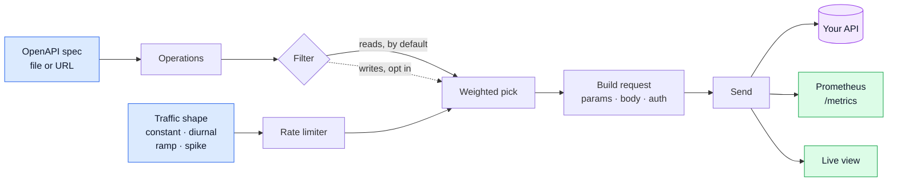

<div align="center">

# Spoofy

**Your staging environment is a ghost town. Spoofy fixes that.**

Point it at an OpenAPI spec. It generates continuous, production-shaped traffic
so your dashboards have signal and your alert thresholds can be tuned against
something other than a flat line.

<p>
  <a href="https://github.com/ashdaily/spoofy/actions/workflows/ci.yml"></a>
  <a href="https://pkg.go.dev/github.com/ashdaily/spoofy"></a>
  
  <a href="LICENSE"></a>
</p>

</div>

---

## The problem

You built a Grafana dashboard for staging. It's empty. You wrote an alert rule.
You can't tell if it works without deliberately breaking something, so you click
around by hand until a graph twitches.

Load testing tools don't help here. k6 and Vegeta answer "can it handle 10k
RPS", a question you ask occasionally. Spoofy answers "does this environment
look alive", which is a condition you want permanently true.

```bash
spoofy run --url https://staging.acme.com --rate 20/s --shape diurnal
```

It runs until you stop it.

---

## Quickstart

```bash
go install github.com/ashdaily/spoofy/cmd/spoofy@latest
```

With an `openapi.yaml` in the current directory:

```bash
spoofy run --url http://localhost:8080
```

Spoofy discovers the spec, exercises every read endpoint, and serves its own
metrics at `:9090/metrics`.

<details>
<summary><b>Not sure what it'll send? Ask first.</b></summary>

```bash
spoofy run --url http://localhost:8080 --dry-run
```

Prints a copy-pasteable `curl` for every endpoint and sends nothing:

```
GET /pets/{petId}

curl -i -X GET \
  -H "Accept: application/json" \
  -H "User-Agent: spoofy" \
  "http://localhost:8080/pets/6f1a9c2e-0b3d-4f8a-91c7-2d5e8a4b0f13"
```
</details>

---

## See it work

```bash
git clone https://github.com/ashdaily/spoofy && cd spoofy
docker compose up
```

Then open **http://localhost:3000**. A demo API, Spoofy, Prometheus, and Grafana
with the dashboard already loaded. Nothing to configure.

| | |
|---|---|
| **http://localhost:3000** | Grafana: traffic, latency percentiles, per-endpoint breakdown |
| **http://localhost:9090** | Prometheus |
| **http://localhost:9091/metrics** | Spoofy's own metrics |
| **http://localhost:8080/openapi.yaml** | The demo API's spec |

The demo API has varied latency, one slow endpoint, and a 2% error rate, so the
dashboard has something on it. A target that always returns 200 in 1ms does not
teach you anything about your monitoring.

---

## How it works



**Values come from the spec before they come from a random number generator:**

```
example → examples → default → const → enum → format → pattern → type
```

Syntactically valid nonsense produces an environment full of 400s, where the
dashboards look busy and prove nothing. Spec examples are real values written by
someone who knows the API, so they take precedence. `pattern` gets a small regex
engine, since the fields specs constrain that way (SKUs, account numbers,
postcodes) are the ones where a random string is rejected outright.

---

## Traffic shapes

**`rate` is always the average.** Changing shape redistributes traffic without
changing the total, so you can try shapes without recalculating anything.

```yaml
traffic:
  rate: 20/s
  shape: diurnal
```

| Shape | Looks like | For |
|---|---|---|
| `constant` | `▄▄▄▄▄▄▄▄▄▄▄▄` | A predictable baseline. The default. |
| `diurnal` | `▂▁▁▂▄▆▇█▇▆▄▂` | Busy afternoons, quiet nights. Makes staging resemble prod. |
| `ramp` | `▁▂▃▄▅▆▇███████` | Watching an autoscaler react, or finding where latency turns. |
| `spike` | `▂▂█▂▂▂▂█▂▂▂▂` | Tripping alert rules on purpose. |

`diurnal` is aligned to wall-clock time of day rather than process start, so
restarting at 3pm resumes at afternoon levels instead of putting a cliff in the
graph that reads as an incident.

Each shape takes a few parameters of its own. See [traffic](#traffic) in the
configuration reference below.

---

## Configuration

Spoofy runs entirely from flags. A config file is optional, and useful once you
want endpoint weights, auth, or settings you'd rather commit than retype.

```bash
spoofy init            # writes spoofy.yaml
spoofy run             # picks it up automatically
```

Flags override the file, so you can keep a committed baseline and vary one thing
on the command line.

### A complete file

Every key Spoofy understands, in one place. Only `target` and `spec` are
required; the rest are shown at their defaults.

```yaml
target: https://staging.acme.com
spec: ./openapi.yaml

traffic:
  rate: 10/s
  shape: constant
  concurrency: 10
  timeout: 10s

  # diurnal only
  amplitude: 0.6
  period: 24h

  # ramp only
  from: 5/s
  to: 50/s
  over: 30m

  # spike only
  spike_every: 30m
  spike_for: 2m
  spike_rate: 100/s

endpoints:
  - match: /admin/*
    skip: true
  - match: /orders
    weight: 5

auth:
  bearer: ${API_TOKEN}
  basic:
    user: ${API_USER}
    pass: ${API_PASS}
  headers:
    X-Tenant: acme

safety:
  allow_writes: false
  allow_prod: false
  max_rate: 200/s

metrics:
  addr: ":9090"
  disabled: false
```

### Value formats

| Type | Accepts | Examples |
|---|---|---|
| **rate** | a count and a unit; bare numbers are per second | `20/s`, `1200/m`, `72000/h`, `0.5/s`, `20` |
| **duration** | Go duration syntax; bare numbers are seconds | `30s`, `5m`, `24h`, `1h30m` |
| **glob** | `*` matches any characters, including `/` | `/admin/*`, `*/{id}`, `/orders` |
| **`${VAR}`** | replaced from the environment at startup | `${API_TOKEN}` |

Unknown keys are rejected at startup rather than ignored, so a typo fails
immediately instead of quietly changing nothing.

### Reference

#### Top level

| Key | Default | Description |
|---|---|---|
| `target` | required | Base URL traffic is sent to. Include any path prefix, e.g. `https://staging.acme.com/v1`. |
| `spec` | discovered | OpenAPI document: a file path or an `http(s)` URL. If omitted, Spoofy looks for `openapi.yaml`, `openapi.json`, `swagger.yaml`, or `swagger.json` in the working directory. |

#### traffic

| Key | Default | Description |
|---|---|---|
| `rate` | `10/s` | Average request rate. Shapes vary around this value without changing the average. |
| `shape` | `constant` | `constant`, `diurnal`, `ramp`, or `spike`. |
| `concurrency` | `10` | Requests in flight at once. A ceiling, not a target. |
| `timeout` | `10s` | Per-request timeout. |
| `amplitude` | `0.6` | *diurnal.* How far traffic swings from the average, between 0 and 1. At `0.6` the peak is 1.6x the average and the trough 0.4x. |
| `period` | `24h` | *diurnal.* Length of one cycle. |
| `from` | `rate` | *ramp.* Starting rate. |
| `to` | required | *ramp.* Rate to climb to, then hold. |
| `over` | required | *ramp.* How long the climb takes. |
| `spike_every` | required | *spike.* Interval between bursts. |
| `spike_for` | required | *spike.* How long each burst lasts. Must be shorter than `spike_every`. |
| `spike_rate` | required | *spike.* Rate during a burst. |

#### endpoints

A list of rules matched against templated paths such as `/orders/{id}`. Rules are
checked in order and the first match wins, like a routing table.

| Key | Default | Description |
|---|---|---|
| `match` | required | Glob matched against the templated path. |
| `skip` | `false` | Exclude matching endpoints entirely. |
| `weight` | `1` | Relative selection frequency. `5` means five times as often as an unweighted endpoint. Weight only biases selection; use `skip` to exclude. |

#### auth

Applied to every generated request. Explicit `headers` are set last, so they win
over anything else.

| Key | Description |
|---|---|
| `bearer` | Sent as `Authorization: Bearer <value>`. |
| `basic.user`, `basic.pass` | HTTP basic credentials. |
| `headers` | Arbitrary headers, as a name-to-value map. |

#### safety

| Key | Default | Description |
|---|---|---|
| `allow_writes` | `false` | Permit `POST`, `PUT`, `PATCH`, and `DELETE`. Without it Spoofy sends only `GET`, `HEAD`, and `OPTIONS`. |
| `allow_prod` | `false` | Permit a target whose hostname contains `prod`, `production`, or `prd`. |
| `max_rate` | `200/s` | Ceiling on `rate`, `to`, and `spike_rate`. Startup fails if any exceeds it. |

#### metrics

| Key | Default | Description |
|---|---|---|
| `addr` | `:9090` | Listen address for `/metrics` and `/healthz`. |
| `disabled` | `false` | Turn the endpoint off entirely. |

### Examples

<details open>
<summary><b>Minimal</b></summary>

Enough to run. Everything else takes its default.

```yaml
target: http://localhost:8080
spec: ./openapi.yaml
```
</details>

<details>
<summary><b>Staging that looks like production</b></summary>

A working day's rhythm, with the endpoint mix biased the way real users behave:
lots of reads on the listing endpoint, occasional detail views, health checks
excluded so they don't drown the graphs.

```yaml
target: https://staging.acme.com/v1
spec: https://staging.acme.com/v1/openapi.json

traffic:
  rate: 25/s
  shape: diurnal
  amplitude: 0.7          # quiet nights, busy afternoons
  concurrency: 16

endpoints:
  - match: /health
    skip: true
  - match: /admin/*
    skip: true
  - match: /products
    weight: 10
  - match: /products/{id}
    weight: 4
  - match: /cart
    weight: 2

auth:
  bearer: ${STAGING_TOKEN}
```
</details>

<details>
<summary><b>Tripping an alert on purpose</b></summary>

A steady baseline with a burst every ten minutes. Set `spike_rate` above the
threshold in your alert rule, then watch whether the alert actually fires and,
just as importantly, whether it resolves.

```yaml
target: http://localhost:8080
spec: ./openapi.yaml

traffic:
  rate: 5/s
  shape: spike
  spike_every: 10m
  spike_for: 90s
  spike_rate: 150/s
  concurrency: 32

safety:
  max_rate: 200/s         # spike_rate is checked against this
```
</details>

<details>
<summary><b>Finding where latency turns</b></summary>

Climb from a gentle rate to a heavy one over half an hour, then hold. Watch the
latency percentiles for the point where the curve bends.

```yaml
target: http://localhost:8080
spec: ./openapi.yaml

traffic:
  shape: ramp
  from: 5/s
  to: 120/s
  over: 30m
  concurrency: 64

safety:
  max_rate: 200/s
```
</details>

<details>
<summary><b>Enabling writes without regret</b></summary>

Writes are off by default. When you turn them on, exclude the destructive
endpoints explicitly. Run it with `--dry-run` first and read what comes back.

```yaml
target: http://localhost:8080
spec: ./openapi.yaml

traffic:
  rate: 8/s
  shape: constant

endpoints:
  - match: /admin/*
    skip: true
  - match: /*/purge
    skip: true
  - match: /users/{id}      # no DELETE against real user records
    skip: true
  - match: /orders
    weight: 3

safety:
  allow_writes: true
```
</details>

<details>
<summary><b>Behind a gateway, multi-tenant</b></summary>

Credentials come from the environment, so the file itself is safe to commit.

```yaml
target: https://gateway.internal/api
spec: ./specs/orders-v2.yaml

traffic:
  rate: 1200/m            # same as 20/s, written the way the team says it
  shape: diurnal

auth:
  headers:
    X-Api-Key: ${GATEWAY_KEY}
    X-Tenant-Id: ${TENANT_ID}
    X-Trace-Sampling: always

metrics:
  addr: ":9464"           # matches the OTel collector convention here
```
</details>

### Flags

<details>
<summary><b>Full list</b></summary>

```
--url, -u             target base URL
--spec, -s            OpenAPI spec: path or URL (default: discovered)
--config, -c          config file (default: spoofy.yaml if present)
--rate, -r            average rate: 20/s, 1200/m, 72000/h
--shape               constant | diurnal | ramp | spike
--concurrency         requests in flight at once
--timeout             per-request timeout
--duration            stop after this long (default: run forever)
--only / --skip       path globs; * spans /
--allow-writes        exercise POST/PUT/PATCH/DELETE
--allow-prod          permit a production-looking hostname
--dry-run             print requests as curl, send nothing
--seed                reproducible runs
--auth-bearer         bearer token
--auth-basic          user:pass
--header              extra header, repeatable
--metrics-addr        Prometheus listen address (default :9090)
--startup-timeout     how long to wait for a remote spec
```

`--only` and `--skip` append to any `endpoints` rules from the config file
rather than replacing them.
</details>

---

## Safety

Spoofy runs unattended for weeks, so a bad default costs a month rather than one
run. These defaults refuse rather than surprise.

| Guard | Behaviour |
|---|---|
| **Read-only** | Only `GET`/`HEAD`/`OPTIONS` until `allow_writes: true`. A daemon POSTing generated rows into staging for a week is a data-loss incident. |
| **Production refusal** | A hostname containing `prod`/`production`/`prd` is rejected unless `allow_prod: true`. |
| **Rate ceiling** | `max_rate` (200/s default) so a typo can't flatten an environment overnight. |
| **Target backoff** | Stops hammering a service that's already failing, and recovers when it returns. |
| **Unknown config keys error** | A silently-ignored typo means a week of doing the wrong thing. |

Spoofy also states what it is not doing, so a filtered-down run cannot pass for
a healthy one:

```
endpoints 5 of 8, skipped 3 writes (use --allow-writes)
```

---

## Metrics

Served at `:9090/metrics`, plus `/healthz` for probes.

| Metric | |
|---|---|
| `spoofy_requests_total{method,path,status,class}` | Requests sent |
| `spoofy_request_duration_seconds` | Latency histogram |
| `spoofy_errors_total{kind}` | Transport failures, bucketed |
| `spoofy_target_up` | 1 when the target answers |
| `spoofy_target_rate` | What the shape is currently asking for |
| `spoofy_requests_in_flight` | Outstanding requests |

`path` is always the templated form (`/pets/{petId}`), never the concrete URL.
Labelling on concrete URLs adds a time series per id and takes Prometheus down
within a day.

> Compare what Spoofy sent against what your app reports receiving. A gap
> between the two is a real finding: dropped requests, broken instrumentation,
> or a misconfigured scrape. It makes Spoofy a way to check your observability
> stack rather than just populate it.

---

## Deploying

<details open>
<summary><b>Docker</b></summary>

```bash
docker run --rm ghcr.io/ashdaily/spoofy:latest run \
  --spec http://api:8080/openapi.json \
  --url http://api:8080 \
  --rate 20/s --shape diurnal
```

A few megabytes on `scratch`, non-root, no shell.
</details>

<details>
<summary><b>Kubernetes</b></summary>

```yaml
apiVersion: apps/v1
kind: Deployment
metadata:
  name: spoofy
spec:
  replicas: 1
  selector:
    matchLabels: { app: spoofy }
  template:
    metadata:
      labels: { app: spoofy }
      annotations:
        prometheus.io/scrape: "true"
        prometheus.io/port: "9090"
    spec:
      containers:
        - name: spoofy
          image: ghcr.io/ashdaily/spoofy:latest
          args:
            - run
            - --spec=http://my-api/openapi.json
            - --url=http://my-api
            - --rate=20/s
            - --shape=diurnal
          ports:
            - { name: metrics, containerPort: 9090 }
          livenessProbe:
            httpGet: { path: /healthz, port: 9090 }
          resources:
            requests: { cpu: 50m, memory: 32Mi }
            limits:   { cpu: 500m, memory: 128Mi }
```

Spoofy handles `SIGTERM` by draining in-flight requests, retries an unreachable
spec on startup, and keeps flat memory over long runs.
</details>

---

## What Spoofy is not

Worth knowing before you adopt it.

- **Not a load tester.** Built for realism at a modest rate, not throughput
  records. Use k6 or Vegeta for "can it handle 10k RPS".
- **It cannot manufacture 5xx.** Spoofy is a client. It can reliably drive
  volume, latency, 4xx rates, and traffic mix. Genuine server errors need your
  app's own fault injection or a service mesh fault filter.
- **It does not assert correctness.** It reports what happened; it does not
  decide whether your API is right. See the roadmap.
- **OpenAPI 3.x only.** Swagger 2.0 is not supported yet.

---

## Roadmap

- **Stateful scenarios.** `POST /login` → token → `POST /orders` → id →
  `GET /orders/{id}`. Without this, generated traffic against resource endpoints
  is largely 404s. This is the big one.
- **Alert exercising.** Drive traffic until a named Prometheus alert fires,
  assert it fired, stop, assert it resolved.
- **Response validation as a metric,** surfacing spec violations without turning
  Spoofy into a test runner.
- **gRPC and GraphQL.**

---

## Contributing

```bash
make test      # unit + integration, race detector on
make lint      # gofmt + go vet
make run       # against the bundled demo API
make demo      # the full compose stack
```

Issues and PRs welcome. If you're adding a traffic shape, it needs a test that
drives it with an injected clock, so a 24-hour cycle is verifiable in
microseconds rather than 24 hours.

## License

Apache-2.0. See [LICENSE](LICENSE).
